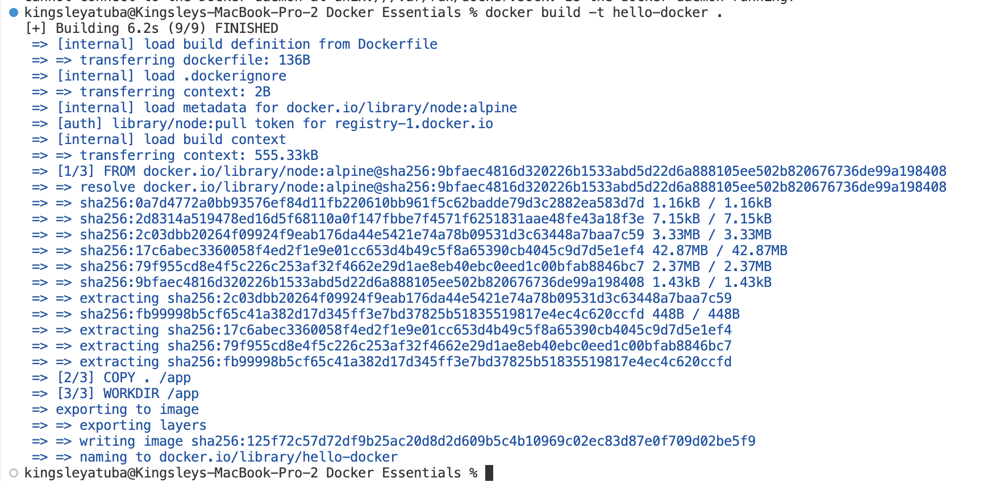
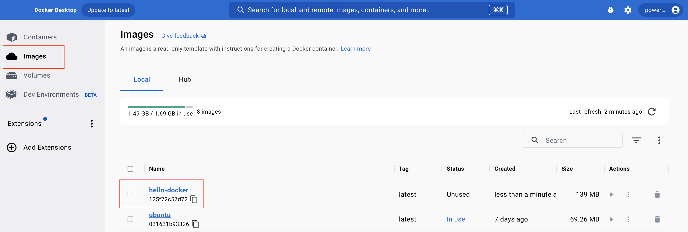
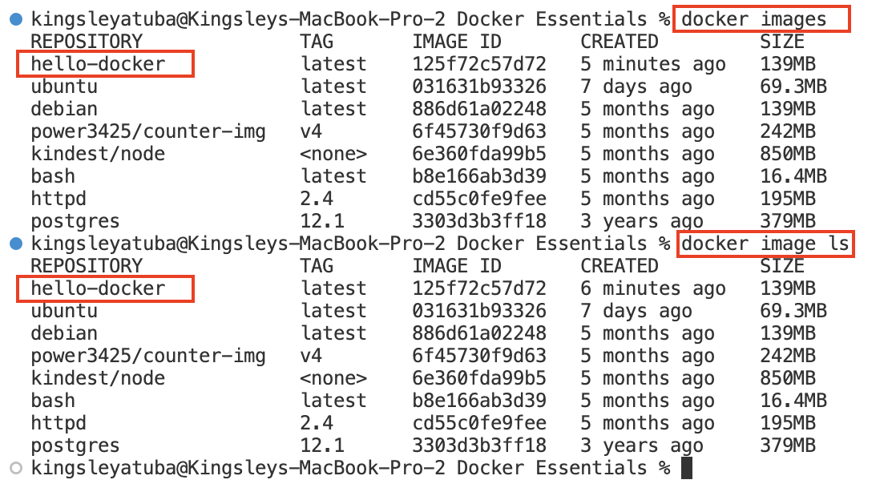
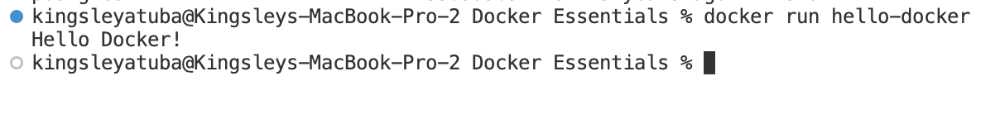
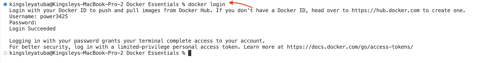
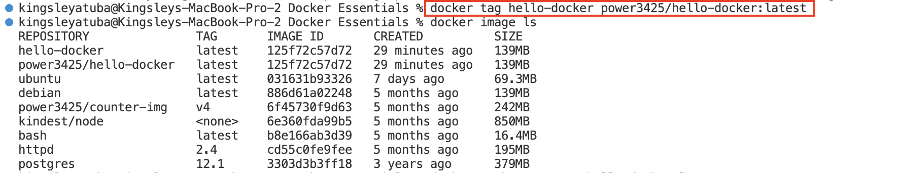
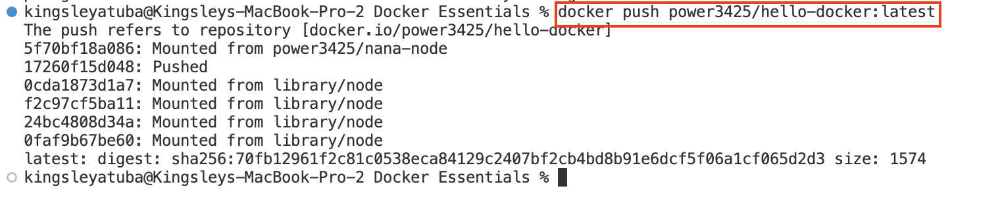
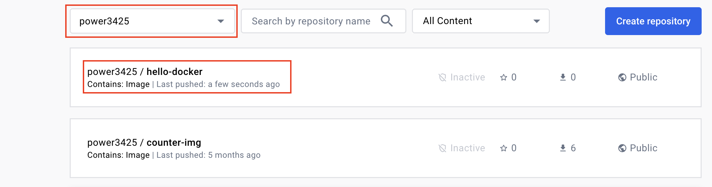
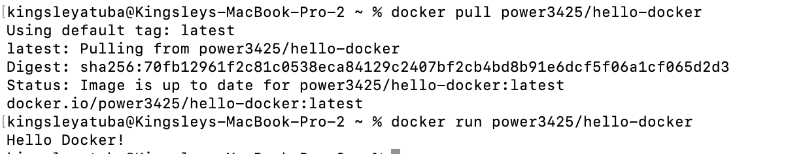

# Docker-Essentials


## Set-up

1. Download the latest version of Docker from [here](https://docs.docker.com/get-docker/) and install it on your machine.

2. Launch your Docker Desktop

3. To confirm that Docker is running on your computer, go to your terminal and run:

```
Docker version
```


4. Create a `Docker Essential` folder and vavigate into it using:

```
mkdir "Docker Essentials"
cd "Docker Essentials"
```

5. Create files named `dockerfile` and `app.js`

```
code dockerfile app.js
```

6. To create a simple "Hello" application, paste this code in app.js:

```
console.log("Hello Docker!");
```

7. Run this code on your terminal to confirm that node is installed and running. If you dont have node, download and install it.

```
node app.js
```


8. To copy your application and run it in a docker container, paste this code in dockerfile:

```
FROM node:alpine
COPY . /app
WORKDIR /app
CMD node app.js
```

> This code is a simple configuration for creating a Docker container that runs a Node.js application:

- FROM node:alpine - This line specifies the base image for the container, using a lightweight version of Node.js based on Alpine Linux.
- COPY . /app - This command copies the contents of the current directory (where the Dockerfile is located) into the /app directory inside the container.
- WORKDIR /app - Sets the working directory inside the container to /app. This is where the commands that follow will be executed.
- CMD node app.js - This is the command that will be run when the container starts. It starts the Node.js application by running app.js

9. Build a docker image by running:

```
docker build -t hello-docker .
```

> The command docker build -t hello-docker . is used to build a Docker image based on the instructions in the Dockerfile located in the current directory.

- docker build: This is the Docker command to build a new image.

- -t hello-docker: This option tags the newly created image. In this case, the image will be tagged with the name hello-docker. Tags are useful for identifying images and are used when running containers based on these images.

- .: This specifies the location of the Dockerfile and the context of the build. The dot (.) represents the current directory, meaning that Docker will look for the Dockerfile in the current directory. It will also send all the files in the current directory to the Docker daemon to be used in the build process.

- When you run this command, Docker reads the Dockerfile in the current directory, executes the instructions in it, and creates a Docker image named hello-docker based on those instructions. If the build is successful, you can then run a container based on this image using a command like `docker run hello-docker`.



10. You can visit your Docker Desktop to confirm creation of Docker image



11. or you run `docker images` or `docker image ls`



12. To run our application from our docker image on a docker container, run `docker run hello-docker`



13. To push your image to Docker hub, first you login to Docker hub:

```
docker login
```



14. Next you need to tag your hello-docker image with your Docker Hub username. Replace yourusername with your actual Docker Hub username

```
docker tag hello-docker yourusername/hello-docker:latest
```



15. Then you push your image to Docker hub:

```
docker push yourusername/hello-docker:latest
```



16. Check Docker Hub to confirm pushed image.



17. You can now go to any laptop, virtual machine or container and download(pull) my image and runn my application.




# Congratulations!
