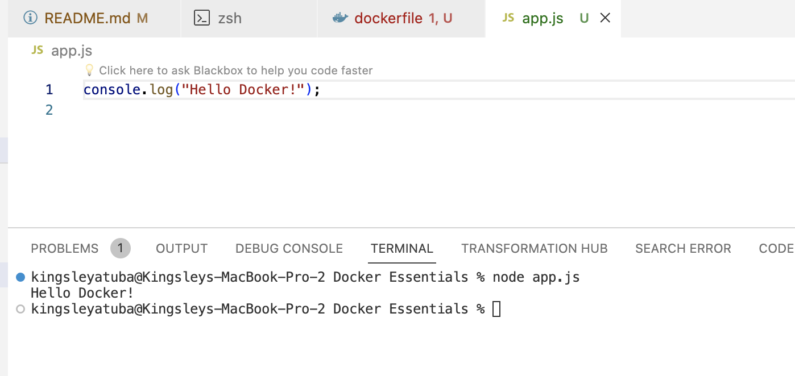

# Docker-Essentials


## Set-up

1. Download the latest version of Docker from [here](https://docs.docker.com/get-docker/) and install it on your machine.

2. Launch your Docker Desktop

3. To confirm that Docker is running on your computer, go to your terminal and run:

```
Docker version
```


4. Create a `Docker Essential` folder and vavigate into it using:

```
mkdir "Docker Essentials"
cd "Docker Essentials"
```

5. Create files named `dockerfile` and `app.js`

```
code dockerfile app.js
```

6. To create a simple "Hello" application, paste this code in app.js:

```
console.log("Hello Docker!");
```

7. Run this code on your terminal to confirm that node is installed and running. If you dont have node, download and install it.

```
node app.js
```



8. To copy your application and run it in a docker container, paste this code in dockerfile:

```
FROM node:alpine
COPY . /app
WORKDIR /app
CMD node app.js
```

> The code in the Dockerfile is a simple configuration for creating a Docker container that runs a Node.js application:

* FROM node:alpine - This line specifies the base image for the container, using a lightweight version of Node.js based on Alpine Linux.
* COPY . /app - This command copies the contents of the current directory (where the Dockerfile is located) into the /app directory inside the container.
* WORKDIR /app - Sets the working directory inside the container to /app. This is where the commands that follow will be executed.
* CMD node app.js - This is the command that will be run when the container starts. It starts the Node.js application by running app.js