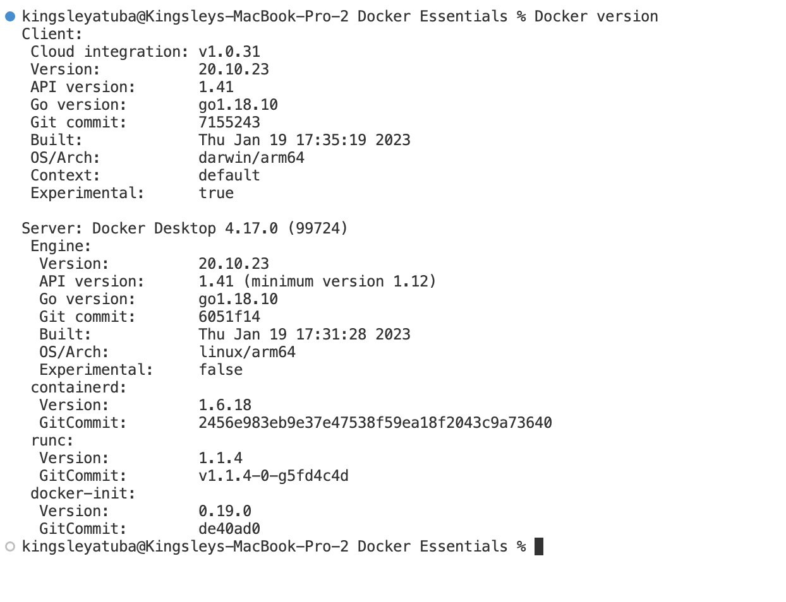

# Docker-Essentials


## Set-up

1. Download the latest version of Docker from [here](https://docs.docker.com/get-docker/) and install it on your machine.

2. Launch your Docker Desktop

3. To confirm that Docker is running on your computer, go to your terminal and run:

```
Docker version
```



4. Create a `Docker Essential` folder using:

```
mkdir "Docker Essentials"
cd "Docker Essentials"
```

5. Create a new file named `dockerfile` and `app.js` 

```
code dockerfile app.js
```


